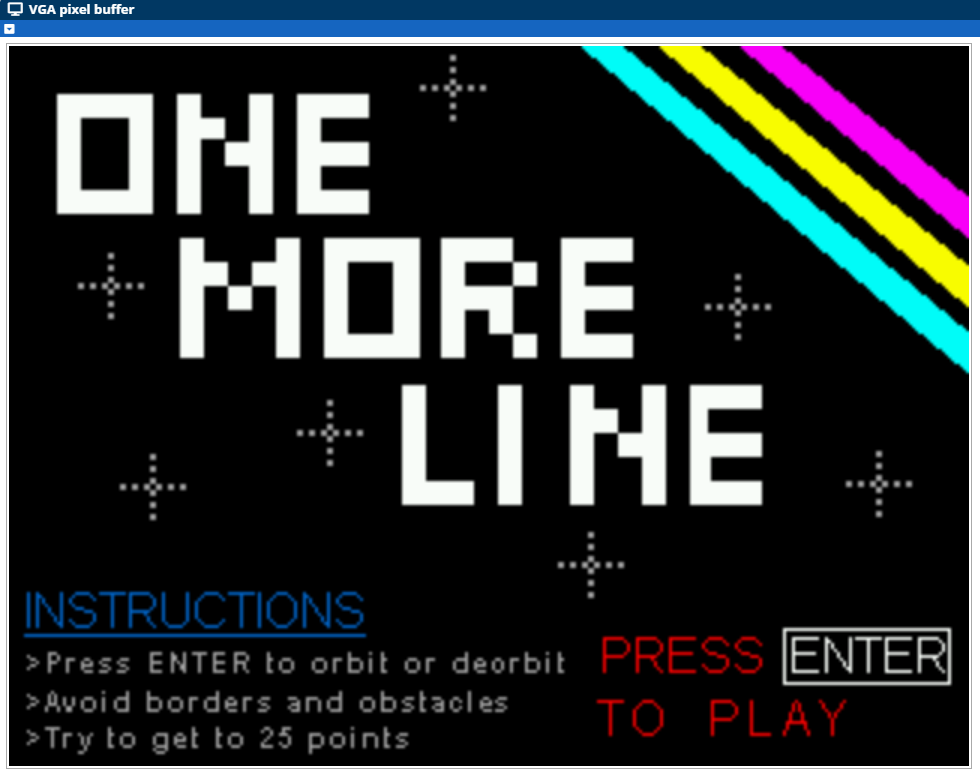
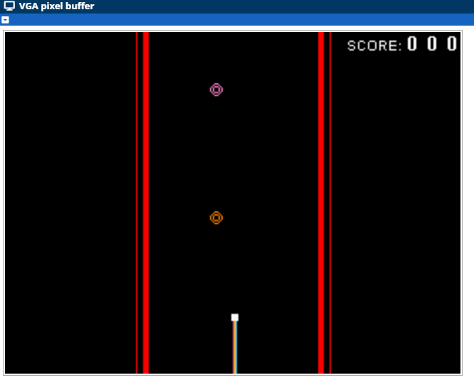
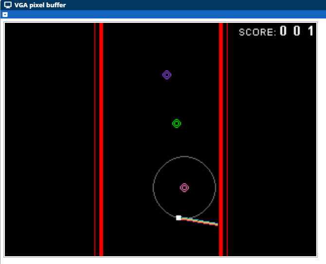
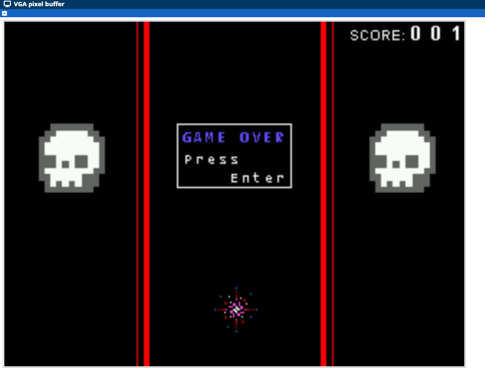
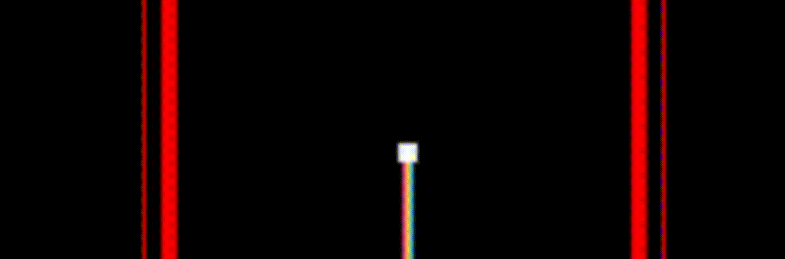
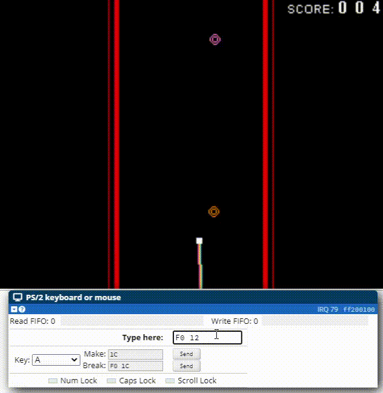

# One More Line

As the final project for the second year Computer Organization course, myself and [Dasha Moskvitina](https://github.com/dasha-moskv) developed a version of the mobile/desktop game [One More Line](http://onemorelinegame.com/), capable of running on the DE1-SoC Computer for the FPGA board of the same name. For a variety of reasons, this code cannot be released publicly. However, if you have any questions about the code, feel free to reach out to either of us.

## The Game

_Below is the user guide included with the project submission, modified for Markdown._

-----

Greetings! If you’re reading this document, you’re probably wondering how to play our game. We’ll walk you through one life cycle of our game, but first there are a couple of things you should know beforehand:

1. The whole game is played using the **ENTER** key
2. There are colourful objects (nodes) that fly towards you and that you can orbit around
3. If you reach 25 points, you win
4. If you touch the red borders, a node, or go too far backwards, you die

Those are the basics, so let's get into playing the game.

### State 1: The Main Menu

When you launch our game, you are greeted with the main menu screen that sparkles and contains some basic instructions. A screenshot of the main menu is shown below in Figure 1. Once you’re ready to play our game, hit the **ENTER** button and wait for the game to begin.

 <i>Figure 1: Main Menu</i>

### State 2: The Game Field

After leaving the main menu, the player (a white block with a rainbow trail) is immediately placed in the game field as shown in Figure 2. In the game field, the player should notice that there are bright red lines, circular nodes, and a score that is displayed in the top right corner.

 <i>Figure 2: The Game Field</i>

The score will increase by one whenever a node reaches the bottom of the screen, and remember, the goal is to reach a score of 25. When you approach a node, hit **ENTER** to orbit around it as shown in Figure 3. A grey circle will draw your track around the node, and you will continue to orbit until you hit **ENTER** again. Once you hit **ENTER** to de-orbit, you will now travel with the same trajectory you had at the instance of hitting **ENTER**. Frequently orbit and deorbit to avoid oncoming nodes, and try to get as far as you can.

 <i>Figure 3: Orbiting around a node</i>

### State 3: The End Screen

Congratulations, you’ve made it through one life cycle of our game. If you died in State 2, you will see an animated explosion, followed by a game over dialog as seen in Figure 4. If you managed to reach 25 points, that means you won and you’ll see the winner dialog shown in Figure 5. Should you want to play our game again, hit **ENTER** and you will be taken back to the menu screen (i.e. State 1).

 <i>Figure 4: Game Over Dialog</i>   

 <i>Figure 5: Winner Dialog</i>

## Feature Spotlight

This section will go into detail on how we implemented a number of features.

### Block movement

The block's previous, current, and next positions are stored internally as screen coordinates, using doubles to minimize rounding errors when orbiting nodes. Also stored is an indicator to determine which node the block is orbiting (or -1, if not orbiting any node). All calculations are performed, and then the Y-axis offset between the next and current position is used to shift the screen in the same direction. Effectively, the block is locked to the X-axis, as demonstrated in the below clip:

  

Additionally, the data is stored for two more frames, so they can be quickly cleared from the double-buffered video controller.

### Orbit

When a user presses **ENTER**, the game checks the following conditions to see if the block can **ENTER** an orbit:

- Is the user within range of a node? (96 pixels on the default 320x240 display)
- Is the node currently on screen?
- Is the user _not_ on a collision course with the node? (must be pointing at least 20 degrees away from the centre of the node)
- Is the user _not_ travelling directly away from the node? (must not be within 20 degrees of directly backwards)

If all conditions are met, the block enters orbit with the node, and stores the information of the node it is orbiting. It then uses the radius and current position to calculate each frame as it moves around. Notably, the orbit speed is the same as the straight line speed of the block When the orbit is exited by hitting **ENTER** again, the node continues at the defined speed. This clip demonstrates some scenarios where the node does not **ENTER** a good orbit:

 <i>When [5A], followed by [F0 5A], flickers on the keyboard input box, that means <b>ENTER</b> was pressed.</i>

### Hardware version

The project was designed to run on [CPUlator](https://cpulator.01xz.net/?sys=arm-de1soc), a WebAssembly emulator for the system. We also created a hardware version of the project, capable of running on a physical board, and substituting the **ENTER** key with one of the buttons on the device. Alternatively, a PS/2 keyboard could be connected to the board to enable the **ENTER** key's usage.